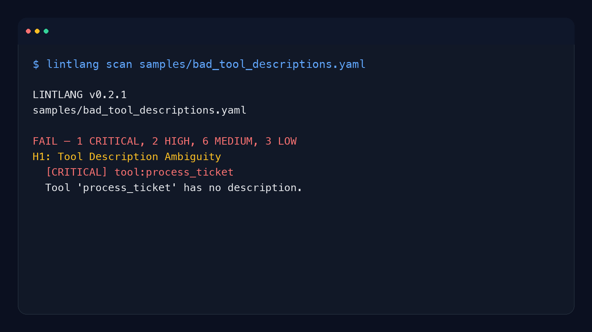

# lintlang

**Static linter for AI agent configs, system prompts, and tool definitions. 7 structural detectors (H1–H7), 6 HERM v1.1 scoring dimensions, validated against 28 comparison files. 154 tests (including a CI-mechanical doc-consistency gate), 0 LLM calls per scan, ~2ms per file.** Reproduce: `bash evals/sample-detection-rate.sh` flags 4-of-4 known-bad samples and passes 1-of-1 clean — same input, same output, every run.

AI agent configs fail for language reasons long before they fail for code reasons: vague tool descriptions, missing stop conditions, and schema fields that say nothing useful.

`lintlang` catches those language-level failures before they hit CI, runtime, or human review — without calling a model.

- "My agent picks the wrong tool because the tool descriptions all sound the same."
- "We only catch prompt and config drift after the agent starts looping."
- "I want a prompt linter or agent-config linter that runs in CI with no model calls."
- "Our YAML is valid, but the instructions inside it are still bad."

```bash
pip install lintlang
```

```bash
lintlang scan samples/bad_tool_descriptions.yaml
```

```text
LINTLANG v0.2.1
samples/bad_tool_descriptions.yaml

FAIL — 1 CRITICAL, 2 HIGH, 6 MEDIUM, 3 LOW
H1: Tool Description Ambiguity
  [CRITICAL] tool:process_ticket
  Tool 'process_ticket' has no description.
```

## How it differs from LLM-based config review

Most agent-config "review" tools call an LLM to grade your YAML. That makes the review **expensive, slow, and itself non-deterministic** — the same config scores differently on Tuesday versus Thursday. lintlang skips the model entirely.

| | LLM-based config review | lintlang |
|---|---|---|
| Cost per scan | $0.01–$0.50 (model + tokens) | **$0.00** |
| Wall time per file | 2–15 s | **~2 ms** |
| Same input → same output | No (sampling-dependent) | **Yes (regex + AST)** |
| Runs offline / in CI without keys | No | **Yes** |
| Catches *vague* tool descriptions | Sometimes | **Always (H1)** |
| Detects *missing* termination conditions | Rarely | **Always (H2)** |

Detection rules are static regex + structural heuristics. The same input produces the same output, every run, every CI.

## When to use it

Use `lintlang` when you author or review AI agent tool descriptions, system prompts, or config files and want a static prompt/config quality gate in CI before runtime testing.

## When NOT to use it

- **Semantic correctness** — lintlang is structural. It catches *vague* tool descriptions, not *wrong* ones. ("delete_user" with empty description fails; "delete_user" pointing at the wrong table is invisible to lintlang.)
- **Open-ended creative writing** — H1–H7 are calibrated for agent configs and system prompts, not prose.
- **Auto-fix** — lintlang reports findings; it doesn't rewrite. Pair with a human or LLM for the fix step.
- **Behavioral safety proofs** — a clean lintlang scan is a *necessary* but not *sufficient* condition for agent safety. Run a runtime evaluator (e.g., the rest of the Hermes Labs audit stack) for dynamic checks.
- **Config formats we don't parse yet** — currently JSON, YAML, plain text, and `.prompt`. Markdown front-matter parses; arbitrary nested templates may not.



[](https://github.com/roli-lpci/lintlang/actions/workflows/ci.yml)
[](https://pypi.org/project/lintlang/)
[](https://pypi.org/project/lintlang/)
[](https://pypi.org/project/lintlang/)
[](https://github.com/roli-lpci/lintlang/blob/main/LICENSE)
[](https://github.com/roli-lpci/lintlang)

**Static linter for AI agent tool descriptions, system prompts, and configs.**

Most AI agent bugs aren't code bugs — they're language bugs. Vague tool descriptions make agents pick the wrong tool. Missing constraints cause infinite loops. Schema mismatches break structured output. lintlang catches these at authoring time, in CI, with zero LLM calls.

## Install

```bash
pip install lintlang
```

Requires Python 3.10+. One dependency (`pyyaml`). No API keys, no network access, no LLM calls.

## Quick Start

```bash
# Scan a single file
lintlang scan agent_config.yaml

# Scan a directory (finds .yaml, .json, .txt, .md, .prompt)
lintlang scan configs/

# JSON output for CI
lintlang scan config.yaml --format json

# Fail CI on CRITICAL/HIGH findings
lintlang scan config.yaml --fail-on fail

# Fail CI on any MEDIUM+ findings
lintlang scan config.yaml --fail-on review
```

### Example Output

```
  LINTLANG v0.2.0
  bad_tool_descriptions.yaml
  ──────────────────────────────────────────────────

  ❌ FAIL — 1 CRITICAL, 2 HIGH, 6 MEDIUM, 3 LOW

  H1: Tool Description Ambiguity

    !! [CRITICAL] tool:process_ticket
      Tool 'process_ticket' has no description.
      → Add a specific description explaining WHEN to use this tool.

    ! [HIGH] tool:get_user_info
      Tool 'get_user_info' has a very short description (13 chars)
      → Expand to include purpose, when to use, expected input/output.

    ~ [MEDIUM] tool:handle_request
      Tool 'handle_request' starts with vague verb 'handle'.
      → Replace with a specific action verb.

  H2: Missing Constraint Scaffolding

    ! [HIGH] system_prompt
      System prompt defines tools but has no termination conditions.
      → Add: 'Maximum 5 tool calls per task. Stop and report after 2 failures.'

  ──────────────────────────────────────────────────
  lintlang v0.2.0 | H1-H7 structural analysis | Zero LLM calls
```

## How It Works

lintlang gives you a **verdict**, not a score:

| Verdict | Meaning | When |
|---------|---------|------|
| ✅ **PASS** | Ship it | Only LOW/INFO findings or none |
| ⚠️ **REVIEW** | Has blind spots | MEDIUM findings present |
| ❌ **FAIL** | Will break in production | CRITICAL or HIGH findings |

Each finding includes the **pattern** (H1-H7), **severity**, **location**, and a **concrete fix suggestion**. No vague "improve your prompt" — specific rewrites you can apply immediately.

## Why These 7 Detectors?

These aren't arbitrary rules — they're the 7 structural failure modes that cause real agent breakdowns in production. We identified them across audits of 8 major AI frameworks (LangChain, Semantic Kernel, AutoGen, smolagents, LiteLLM, Anthropic SDK, OpenAI SDK, Agno) and 12 filed PRs. Each detector maps to a specific class of bug that no other linter catches because they're language problems, not code problems.

No existing tool covers this: yamllint checks syntax, semgrep checks code patterns, ruff checks Python style. None of them can tell you that your tool description is ambiguous enough to cause wrong-tool selection, or that your system prompt lacks termination conditions and will loop forever.

## Structural Detectors (H1-H7)

| Pattern | Name | What Users Report | Severity |
|---------|------|-------------------|----------|
| **H1** | Tool Description Ambiguity | "Agent picks wrong tool" | CRITICAL-MEDIUM |
| **H2** | Missing Constraint Scaffolding | "Agent loops infinitely" | CRITICAL-HIGH |
| **H3** | Schema-Intent Mismatch | "Structured output broken" | CRITICAL-LOW |
| **H4** | Context Boundary Erosion | "Agent leaks state across tasks" | HIGH-MEDIUM |
| **H5** | Implicit Instruction Failure | "Model doesn't follow instructions" | MEDIUM-LOW |
| **H6** | Template Format Contract Violation | "Agent broke after prompt change" | MEDIUM-INFO |
| **H7** | Role Confusion | "Chat history is messed up" | CRITICAL-MEDIUM |

### H5: Context-Aware Negatives

H5 distinguishes between **safety constraints** and **style negatives**. Security rules like "Never expose API keys" are correctly exempted. Style issues like "Don't be verbose" are flagged with positive rewrites.

Validated on 26 real-world configs (OpenHands, RAG agents, HIPAA compliance, financial advisors, content moderation, DevOps safety) — see [`samples/`](samples/) for examples.

### Why not just use GPT-4?

Zero cost, zero latency, zero data exposure. Runs in CI where LLM calls can't. Catches structural patterns (missing termination, schema mismatches, role ordering) that LLMs are blind to because they process content, not structure.

## CI Integration

### GitHub Actions

```yaml
- name: Lint agent configs
  run: |
    pip install lintlang
    lintlang scan configs/ --fail-on fail
```

### Verdict-Based Gating

| Flag | Exits 1 when | Use case |
|------|-------------|----------|
| `--fail-on fail` | Any CRITICAL/HIGH finding | Blocking deploy gate |
| `--fail-on review` | Any MEDIUM+ finding | Strict quality gate |
| `--fail-under 80` | Quality score < threshold | Legacy score-based gate |

### Filter by Severity

```bash
# Only show CRITICAL and HIGH
lintlang scan config.yaml --min-severity high

# Only check specific patterns
lintlang scan config.yaml --patterns H1 H3
```

## Programmatic API

```python
from lintlang import scan_file, compute_verdict

result = scan_file("config.yaml")
verdict = compute_verdict(result.structural_findings)
print(f"Verdict: {verdict}")  # PASS, REVIEW, or FAIL

for finding in result.structural_findings:
    print(f"  [{finding.severity.value}] {finding.description}")
    print(f"  → {finding.suggestion}")
```

```python
# Scan a directory
from lintlang import scan_directory, compute_verdict

results = scan_directory("configs/")
for path, result in results.items():
    verdict = compute_verdict(result.structural_findings)
    print(f"{path}: {verdict}")
```

## Supported Formats

lintlang auto-detects file format:

- **YAML** (`.yaml`, `.yml`) — OpenAI function-calling format, tool definitions
- **JSON** (`.json`) — OpenAI and Anthropic tool schemas, message arrays
- **Plain text** (`.txt`, `.md`, `.prompt`) — System prompts, instruction docs

Unknown extensions are tried as JSON → YAML → plain text.

## How Is lintlang Different?

| Tool | What It Does | How lintlang Differs |
|------|-------------|---------------------|
| **promptfoo** | Tests prompts via eval suites at runtime | lintlang is static — no LLM calls, catches issues at authoring time |
| **guardrails-ai** | Validates LLM outputs at runtime | lintlang catches root causes (bad instructions), not symptoms |
| **NeMo Guardrails** | Runtime dialogue rails | lintlang operates on config files, not live conversations |
| **eslint / ruff** | Lints source code | lintlang lints natural language in agent configs |

lintlang treats tool descriptions, system prompts, and agent configs as **lintable artifacts** — static analysis for prose, like eslint for JavaScript.

## Development

```bash
git clone https://github.com/roli-lpci/lintlang.git
cd lintlang
pip install -e ".[dev]"
pytest
```

## License

[Apache 2.0](LICENSE)

---

## About Hermes Labs

[Hermes Labs](https://hermes-labs.ai) builds AI audit infrastructure for enterprise AI systems — EU AI Act readiness, ISO 42001 evidence bundles, continuous compliance monitoring, agent-level risk testing. We work with teams shipping AI into regulated environments.

**Our OSS philosophy — read this if you're deciding whether to depend on us:**

- **Everything we release is free, forever.** MIT or Apache-2.0. No "open core," no SaaS tier upsell, no paid version with the features you actually need. You can run this repo commercially, without talking to us.
- **We open-source our own infrastructure.** The tools we release are what Hermes Labs uses internally — we don't publish demo code, we publish production code.
- **We sell audit work, not licenses.** If you want an ANNEX-IV pack, an ISO 42001 evidence bundle, gap analysis against the EU AI Act, or agent-level red-teaming delivered as a report, that's at [hermes-labs.ai](https://hermes-labs.ai). If you just want the code to run it yourself, it's right here.

**The Hermes Labs OSS audit stack** (public, production-grade, no SaaS):

**Static audit** (before deployment)
- [**rule-audit**](https://github.com/hermes-labs-ai/rule-audit) — Static prompt audit — contradictions, coverage gaps, priority ambiguities. `pip install rule-audit`
- [**scaffold-lint**](https://github.com/hermes-labs-ai/scaffold-lint) — Scaffold budget + technique stacking (flags `SCAFFOLD_TOO_LONG`, `SCAFFOLD_STACKING`). `pip install scaffold-lint`
- [**intent-verify**](https://github.com/hermes-labs-ai/intent-verify) — Repo intent verification + spec-drift checks

**Runtime observability** (while the agent runs)
- [**little-canary**](https://github.com/hermes-labs-ai/little-canary) — Prompt injection detection via sacrificial canary-model probes
- [**suy-sideguy**](https://github.com/hermes-labs-ai/suy-sideguy) — Runtime policy guard — user-space enforcement + forensic reports
- [**colony-probe**](https://github.com/hermes-labs-ai/colony-probe) — Prompt confidentiality audit — detects system-prompt reconstruction

**Regression & scoring** (to prove what changed)
- [**hermes-jailbench**](https://github.com/hermes-labs-ai/hermes-jailbench) — Jailbreak regression benchmark. `pip install hermes-jailbench`
- [**agent-convergence-scorer**](https://github.com/hermes-labs-ai/agent-convergence-scorer) — Score how similar N agent outputs are. `pip install agent-convergence-scorer`

**Supporting infra**
- [**claude-router**](https://github.com/hermes-labs-ai/claude-router) · [**zer0dex**](https://github.com/hermes-labs-ai/zer0dex) · [**forgetted**](https://github.com/hermes-labs-ai/forgetted) · [**quick-gate-python**](https://github.com/hermes-labs-ai/quick-gate-python) · [**quick-gate-js**](https://github.com/hermes-labs-ai/quick-gate-js) · [**repo-audit**](https://github.com/hermes-labs-ai/repo-audit)

Natural pairing: lintlang catches *structural* problems in agent configs (H1-H7, HERM scoring). rule-audit catches *logical* contradictions in the rules inside. scaffold-lint catches *scaffold-level* bloat. Run all three in CI for full static coverage.

---

If lintlang saves you time, please [star the repo](https://github.com/hermes-labs-ai/lintlang) — it helps others find it.
