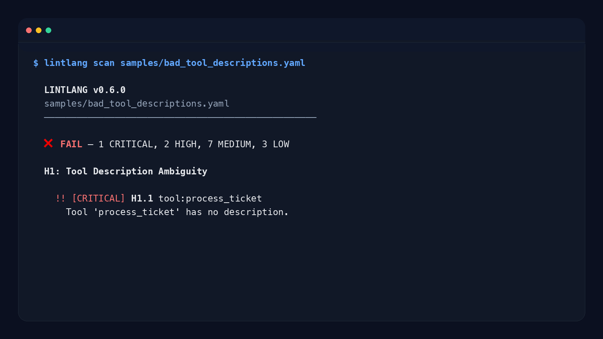

# lintlang

**lintlang is a static linter for AI agent configs, tool descriptions, and system prompts that runs zero-LLM quality gating in CI. 7 structural detectors (H1–H7), 6 HERM v1.1 scoring dimensions, validated against 28 comparison files. 159 tests (including CI-mechanical documentation and release-version consistency gates), 0 LLM calls per scan, ~2ms per file.** Reproduce: `bash evals/sample-detection-rate.sh` flags 4-of-4 known-bad samples and passes 1-of-1 clean — same input, same output, every run.

AI agent configs fail for language reasons long before they fail for code reasons: vague tool descriptions, missing stop conditions, and schema fields that say nothing useful.

`lintlang` catches those language-level failures before they hit CI, runtime, or human review — without calling a model.

- "My agent picks the wrong tool because the tool descriptions all sound the same."
- "We only catch prompt and config drift after the agent starts looping."
- "I want a prompt linter or agent-config linter that runs in CI with no model calls."
- "Our YAML is valid, but the instructions inside it are still bad."

```bash
pip install lintlang
```

```bash
lintlang scan samples/bad_tool_descriptions.yaml
```

```text
LINTLANG v0.3.1
samples/bad_tool_descriptions.yaml

FAIL — 1 CRITICAL, 2 HIGH, 6 MEDIUM, 3 LOW
H1: Tool Description Ambiguity
  [CRITICAL] tool:process_ticket
  Tool 'process_ticket' has no description.
```

## How it differs from LLM-based config review

Most agent-config "review" tools call an LLM to grade your YAML. That makes the review **expensive, slow, and itself non-deterministic** — the same config scores differently on Tuesday versus Thursday. lintlang skips the model entirely.

| | LLM-based config review | lintlang |
|---|---|---|
| Cost per scan | $0.01–$0.50 (model + tokens) | **$0.00** |
| Wall time per file | 2–15 s | **~2 ms** |
| Same input → same output | No (sampling-dependent) | **Yes (regex + AST)** |
| Runs offline / in CI without keys | No | **Yes** |
| Catches *vague* tool descriptions | Model-dependent | **Static H1 heuristic** |
| Detects *missing* termination conditions | Model-dependent | **Static H2 heuristic** |

Detection rules are static regex + structural heuristics. The same input produces the same output, every run, every CI.

## When to use it

Use `lintlang` when you author or review AI agent tool descriptions, system prompts, or config files and want a static prompt/config quality gate in CI before runtime testing.

## When NOT to use it

- **Semantic correctness** — lintlang is structural. It catches *vague* tool descriptions, not *wrong* ones. ("delete_user" with empty description fails; "delete_user" pointing at the wrong table is invisible to lintlang.)
- **Open-ended creative writing** — H1–H7 are calibrated for agent configs and system prompts, not prose.
- **Auto-fix** — lintlang reports findings; it doesn't rewrite. Pair with a human or LLM for the fix step.
- **Behavioral safety proofs** — a clean lintlang scan is a *necessary* but not *sufficient* condition for agent safety. Run a runtime evaluator (e.g., the rest of the Hermes Labs audit stack) for dynamic checks.
- **Config formats we don't parse yet** — currently JSON, YAML, plain text, and `.prompt`. Markdown front-matter parses; arbitrary nested templates may not.



[](https://github.com/hermes-labs-ai/lintlang/actions/workflows/ci.yml)
[](https://pypi.org/project/lintlang/)
[](https://pypi.org/project/lintlang/)
[](https://pypi.org/project/lintlang/)
[](https://github.com/hermes-labs-ai/lintlang/blob/main/LICENSE)
[](https://github.com/hermes-labs-ai/lintlang)

**Static linter for AI agent tool descriptions, system prompts, and configs.**

Most AI agent bugs aren't code bugs — they're language bugs. Vague tool descriptions make agents pick the wrong tool. Missing constraints cause infinite loops. Schema mismatches break structured output. lintlang catches these at authoring time, in CI, with zero LLM calls.

## Install

```bash
pip install lintlang
```

Requires Python 3.10+. One dependency (`pyyaml`). No API keys. Default scans make no network calls and no LLM calls. The one exception is the opt-in `--enable-embeddings` flag (P3 scaffold-quality check), which calls a local Ollama instance (`localhost:11434`) for embeddings and fails open with no findings if Ollama isn't running. No external network access either way.

## Quick Start

```bash
# Scan a single file
lintlang scan agent_config.yaml

# Scan a directory (finds .yaml, .json, .txt, .md, .prompt)
lintlang scan configs/

# JSON output for CI
lintlang scan config.yaml --format json

# Fail CI on CRITICAL/HIGH findings
lintlang scan config.yaml --fail-on fail

# Fail CI on any MEDIUM+ findings
lintlang scan config.yaml --fail-on review
```

### Example Output

```
  LINTLANG v0.3.1
  bad_tool_descriptions.yaml
  ──────────────────────────────────────────────────

  ❌ FAIL — 1 CRITICAL, 2 HIGH, 6 MEDIUM, 3 LOW

  H1: Tool Description Ambiguity

    !! [CRITICAL] tool:process_ticket
      Tool 'process_ticket' has no description.
      → Add a specific description explaining WHEN to use this tool.

    ! [HIGH] tool:get_user_info
      Tool 'get_user_info' has a very short description (13 chars)
      → Expand to include purpose, when to use, expected input/output.

    ~ [MEDIUM] tool:handle_request
      Tool 'handle_request' starts with vague verb 'handle'.
      → Replace with a specific action verb.

  H2: Missing Constraint Scaffolding

    ! [HIGH] system_prompt
      System prompt defines tools but has no termination conditions.
      → Add: 'Maximum 5 tool calls per task. Stop and report after 2 failures.'

  ──────────────────────────────────────────────────
  lintlang v0.3.1 | H1-H7 structural analysis | Zero LLM calls
```

## How It Works

lintlang gives you a **verdict**, not a score:

| Verdict | Meaning | When |
|---------|---------|------|
| ✅ **PASS** | No blocking structural finding detected | Only LOW/INFO findings or none |
| ⚠️ **REVIEW** | Review structural warnings | MEDIUM findings present |
| ❌ **FAIL** | Blocking structural finding detected | CRITICAL or HIGH findings |

Each finding includes the **pattern** (H1-H7), **severity**, **location**, and a **concrete fix suggestion**. No vague "improve your prompt" — specific rewrites you can apply immediately.

## Why These 7 Detectors?

These rules target seven recurring structural risks in agent configuration and
prompt surfaces. They were developed from audits across major AI frameworks;
each detector maps to a language-level condition that general code and schema
linters do not evaluate.

Tools such as yamllint, semgrep, and ruff cover syntax or source-code patterns.
lintlang focuses on a different layer: whether descriptions are ambiguous or
whether an instruction surface omits explicit termination conditions. Those
findings are structural warnings, not predictions of runtime behavior.

## Structural Detectors (H1-H7)

| Pattern | Name | What Users Report | Severity |
|---------|------|-------------------|----------|
| **H1** | Tool Description Ambiguity | "Agent picks wrong tool" | CRITICAL-MEDIUM |
| **H2** | Missing Constraint Scaffolding | "Agent loops infinitely" | CRITICAL-HIGH |
| **H3** | Schema-Intent Mismatch | "Structured output broken" | CRITICAL-LOW |
| **H4** | Context Boundary Erosion | "Agent leaks state across tasks" | HIGH-MEDIUM |
| **H5** | Implicit Instruction Failure | "Model doesn't follow instructions" | MEDIUM-LOW |
| **H6** | Template Format Contract Violation | "Agent broke after prompt change" | MEDIUM-INFO |
| **H7** | Role Confusion | "Chat history is messed up" | CRITICAL-MEDIUM |

### H5: Context-Aware Negatives

H5 distinguishes between **safety constraints** and **style negatives**. Security rules like "Never expose API keys" are correctly exempted. Style issues like "Don't be verbose" are flagged with positive rewrites.

Validated on 26 real-world configs (OpenHands, RAG agents, HIPAA compliance, financial advisors, content moderation, DevOps safety) — see [`samples/`](samples/) for examples.

### Why not just use GPT-4?

Zero cost, zero latency, zero data exposure. Runs in CI where LLM calls can't. Catches structural patterns (missing termination, schema mismatches, role ordering) that LLMs are blind to because they process content, not structure.

## CI Integration

### GitHub Actions

```yaml
- name: Lint agent configs
  run: |
    pip install lintlang
    lintlang scan configs/ --fail-on fail
```

### Verdict-Based Gating

| Flag | Exits 1 when | Use case |
|------|-------------|----------|
| `--fail-on fail` | Any CRITICAL/HIGH finding | Blocking deploy gate |
| `--fail-on review` | Any MEDIUM+ finding | Strict quality gate |
| `--fail-under 80` | Quality score < threshold | Legacy score-based gate |

Input integrity is a separate fatal channel: every explicitly requested input,
and every supported file discovered in a requested directory, must be readable
and parseable. A missing, unreadable, or malformed input exits `1` regardless
of `--fail-on`. JSON output keeps the affected path in the result list with
`"verdict": "ERROR"` and a non-null `"input_error"`; it is never labeled
`PASS` or silently omitted because another input scanned successfully.

### Filter by Severity

```bash
# Only show CRITICAL and HIGH
lintlang scan config.yaml --min-severity high

# Only check specific patterns
lintlang scan config.yaml --patterns H1 H3
```

## Programmatic API

```python
from lintlang import scan_file, compute_verdict

result = scan_file("config.yaml")
if result.input_error:
    raise ValueError(f"lintlang could not scan the input: {result.input_error}")
verdict = compute_verdict(result.structural_findings)
print(f"Verdict: {verdict}")  # PASS, REVIEW, or FAIL

for finding in result.structural_findings:
    print(f"  [{finding.severity.value}] {finding.description}")
    print(f"  → {finding.suggestion}")
```

```python
# Scan a directory
from lintlang import scan_directory, compute_verdict

results = scan_directory("configs/")
for path, result in results.items():
    if result.input_error:
        print(f"{path}: ERROR — {result.input_error}")
        continue
    verdict = compute_verdict(result.structural_findings)
    print(f"{path}: {verdict}")
```

## Supported Formats

lintlang auto-detects file format:

- **YAML** (`.yaml`, `.yml`) — OpenAI function-calling format, tool definitions
- **JSON** (`.json`) — OpenAI and Anthropic tool schemas, message arrays
- **Plain text** (`.txt`, `.md`, `.prompt`) — System prompts, instruction docs

Unknown extensions are tried as JSON → YAML → plain text.

## How Is lintlang Different?

| Tool | What It Does | How lintlang Differs |
|------|-------------|---------------------|
| **promptfoo** | Tests prompts via eval suites at runtime | lintlang is static — no LLM calls, catches issues at authoring time |
| **guardrails-ai** | Validates LLM outputs at runtime | lintlang catches root causes (bad instructions), not symptoms |
| **NeMo Guardrails** | Runtime dialogue rails | lintlang operates on config files, not live conversations |
| **eslint / ruff** | Lints source code | lintlang lints natural language in agent configs |

lintlang treats tool descriptions, system prompts, and agent configs as **lintable artifacts** — static analysis for prose, like eslint for JavaScript.

## Development

```bash
git clone https://github.com/hermes-labs-ai/lintlang.git
cd lintlang
pip install -e ".[dev]"
pytest
```

## License

[Apache 2.0](LICENSE)

---

## About Hermes Labs

Hermes Labs is an independent AI-reliability lab building open-source tools that catch silent failure modes in production AI. More at [hermes-labs.ai](https://hermes-labs.ai).
