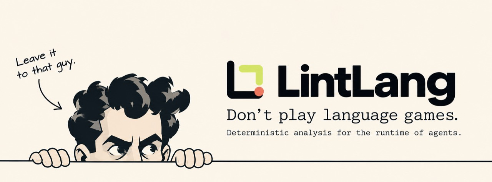
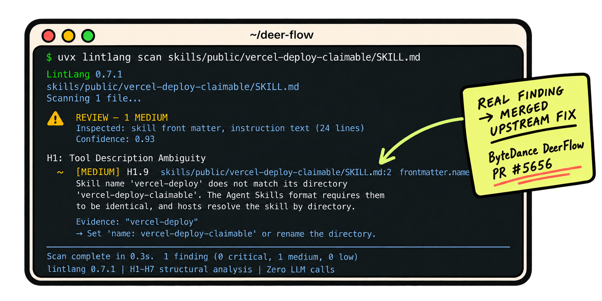

<div align="center">

# LintLang



**Catch agent failures before your agent runs.**

[](https://github.com/hermes-labs-ai/lintlang/actions/workflows/ci.yml)
[](https://pypi.org/project/lintlang/)
[](https://pypistats.org/packages/lintlang)
[](https://pypi.org/project/lintlang/)
[](LICENSE)
[](https://scorecard.dev/viewer/?uri=github.com/hermes-labs-ai/lintlang)

[Product page](https://lintlang.ai/) · [Playground](https://hermes-labs.ai/lintlang#playground) · [PyPI](https://pypi.org/project/lintlang/) · [Docs](llms-full.txt)

</div>

LintLang is a local, deterministic static linter for the instructions and tool interfaces an AI agent is given. It flags ambiguous tool choices, conflicting requirements, schema gaps, missing bounds, and other setup defects before the agent runs.

**Point it at a project directory.** LintLang finds supported agent-facing content inside the files you already use: MCP and function-tool definitions nested in JSON/YAML, parameter schemas, system prompts, messages, output contracts, `AGENTS.md`, `CLAUDE.md`, `GEMINI.md`, `SKILL.md`, and supported Python prompt code.

```bash
uvx lintlang scan .
```

<div align="center">

<p><strong>See LintLang in action.</strong> A stylized view of the real DeerFlow finding behind <a href="https://github.com/bytedance/deer-flow/pull/5656">merged PR #5656</a>.</p>



</div>

LintLang is developed by [Hermes Labs](https://hermes-labs.ai/).

## What LintLang catches

Agent configuration can be valid YAML, JSON, Markdown, or Python and still give a model bad instructions, bad choices, or an interface it cannot reliably use.

LintLang catches problems like:

- **Ambiguous tools** — sibling tools that overlap without a clear reason for the model to choose one over another.
- **Missing bounds** — retries, loops, or tool use without explicit stopping or progress conditions.
- **Schema mismatches** — missing required fields, unclear parameters, and schemas that do not communicate enough intent.
- **Conflicting instructions** — incompatible output requirements, vague priorities, and contradictory directions.
- **SKILL.md defects** — missing or invalid metadata, unclear usage criteria, and skill names that do not match their directory.
- **Context and message errors** — stale project references, unbounded persistence, malformed roles, and broken tool-message sequences.
- **Embedded agent logic** — supported Python prompts, literal tool definitions, and selected pipeline thresholds.

Each result says what LintLang inspected. Content with no recognized agent-facing structures is reported as `SKIPPED`, never `PASS`. Tool comparisons are within one parsed input; a directory scan does not combine tools from separate files into one selection namespace.

For exact extraction rules and detector behavior, see the [technical reference](llms-full.txt).

## Quickstart

Requires Python 3.10+.

Run once without installing:

```bash
uvx lintlang scan .
```

Or name a specific configuration source:

```bash
uvx lintlang scan AGENTS.md
uvx lintlang scan SKILL.md
uvx lintlang scan agent.yaml
```

Install with pip:

```bash
pip install lintlang
lintlang scan .
```

Or with Homebrew on macOS:

```bash
brew install hermes-labs-ai/tap/lintlang
lintlang scan .
```

Findings are advisory by default.

Block on HIGH or CRITICAL findings:

```bash
lintlang scan . --fail-on fail
```

Include MEDIUM findings in the gate:

```bash
lintlang scan . --fail-on review
```

LintLang also emits JSON and SARIF for automation and GitHub Code Scanning.

## Put it in CI

Generate a pinned GitHub Actions workflow that scans the repository directory:

```bash
lintlang init --github --path .
```

The generated Action gates HIGH or CRITICAL findings by default. Use a narrower path when CI should check only one configuration source.

For an existing repository with known findings, record a reviewed baseline:

```bash
lintlang scan . --write-baseline .lintlang-baseline.json
```

Then gate new or changed findings:

```bash
lintlang scan . \
  --baseline .lintlang-baseline.json \
  --fail-on review
```

See [GitHub CI and Code Scanning](docs/github.md) and [baseline adoption](docs/baselines.md).

## Integrations

LintLang works with GitHub Actions, GitHub Code Scanning, pre-commit, Claude Code, Cursor, GitHub Copilot CLI, Gemini CLI, Pi, OpenCode, Hermes Agent, and MegaLinter.

See the [integration guide](docs/integrations.md) for setup and compatibility.

LintLang does not run models, observe runtime tool choices, or establish that an agent is production-safe. A clean scan means only that the selected static checks found no covered defects in the recognized content.

## Documentation

- [Technical reference](llms-full.txt) — supported structures, detector behavior, CLI, JSON, and SARIF
- [GitHub CI and Code Scanning](docs/github.md)
- [Baselines](docs/baselines.md)
- [Integrations](docs/integrations.md)
- [Changelog](CHANGELOG.md)

## Contributing

Bug reports, disputed findings, reproducible false positives, documentation corrections, and focused contributions are welcome.

See [CONTRIBUTING.md](CONTRIBUTING.md) and [SECURITY.md](SECURITY.md).

## License

[Apache License 2.0](LICENSE)
