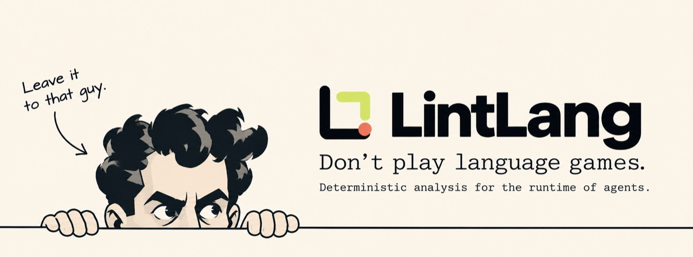

<div align="center">

# LintLang



**Catch agent failures before your agent runs.**

[](https://github.com/hermes-labs-ai/lintlang/actions/workflows/ci.yml)
[](https://pypi.org/project/lintlang/)
[](https://pypistats.org/packages/lintlang)
[](https://pypi.org/project/lintlang/)
[](LICENSE)
[](https://scorecard.dev/viewer/?uri=github.com/hermes-labs-ai/lintlang)

[Product page](https://lintlang.ai/) · [Playground](https://hermes-labs.ai/lintlang#playground) · [PyPI](https://pypi.org/project/lintlang/) · [Docs](llms-full.txt) · [简体中文](docs/zh-CN/README.md)

</div>

LintLang is a local, deterministic static linter for the instructions and tool interfaces an AI agent is given. It flags ambiguous tool choices, mixed output formats, schema gaps, missing bounds, and other setup defects before the agent runs.

**Point it at a project directory.** LintLang finds supported agent-facing content inside the files you already use: MCP and function-tool definitions nested in JSON/YAML, parameter schemas, system prompts, messages, output contracts, `AGENTS.md`, `CLAUDE.md`, `GEMINI.md`, `SKILL.md`, and supported Python prompt code.

```bash
uvx lintlang scan .
```

<div align="center">

<p><strong>See LintLang in action.</strong> A stylized view of the real DeerFlow finding behind <a href="https://github.com/bytedance/deer-flow/pull/5656">merged PR #5656</a>.</p>


</div>

Below, by contrast, is unedited terminal output on a bundled fixture: two of the nine findings from `lintlang scan --no-gate samples/bad_tool_descriptions.yaml`, long lines wrapped.

```text
  ❌ FAIL — 1 HIGH, 5 MEDIUM, 3 LOW
  Inspected: 5 tools (4 described, 5 with a schema), system prompt

    ~ [MEDIUM] H1.3 samples/bad_tool_descriptions.yaml:27  tool:handle_request
      Tool 'handle_request' starts with vague verb 'handle'.
      Evidence: "Handle the user request"
      → Replace 'handle' with a specific action verb. Instead of 'Handle user data', use 'Validate and persist user profile updates to the database'.

    ~ [MEDIUM] H1.6 samples/bad_tool_descriptions.yaml:10  tool:get_user_info vs tool:fetch_user_data
      Tools 'get_user_info' and 'fetch_user_data' carry no differentia — every meaning-bearing term in one is
      present, or has a synonym, in the other. Both descriptions may be accurate and still give a model nothing
      to choose between them.
      Evidence: "'Get user info' vs 'Get user data from the system'"
      → Name a condition that selects one over the other. State what each tool is for that the other is NOT
      for — e.g. 'use X for orders already placed, use Y for carts not yet submitted'.
```

## How LintLang differs

- **From LLM-as-judge reviewers:** no model calls and no network access during a scan. `pyyaml` is the only runtime dependency, and the test suite runs the CLI with outbound sockets disabled (`tests/test_first_run_recipe.py`). Findings and verdicts are deterministic: the same tree produces byte-identical JSON and SARIF (`tests/test_sarif.py`); only the terminal summary's elapsed time varies. That is what lets it gate CI.
- **From generic linters:** agent-aware. It reads tool descriptions, system prompts, `SKILL.md`, MCP definitions, and parameter schemas as instructions a model will act on, not as prose.
- Every finding names the file and proposes a specific fix, and cites the line wherever the parser can justify one. LintLang never invents line numbers.

## What LintLang catches

Agent configuration can be valid YAML, JSON, Markdown, or Python and still give a model bad instructions, bad choices, or an interface it cannot reliably use.

LintLang catches problems like:

- **Ambiguous tools** — sibling tools that overlap without a clear reason for the model to choose one over another.
- **Missing bounds** — retries, loops, or tool use without explicit stopping or progress conditions.
- **Schema mismatches** — missing required fields, unclear parameters, and schemas that do not communicate enough intent.
- **SKILL.md defects** — missing or invalid metadata, unclear usage criteria, and skill names that do not match their directory.
- **Context and message errors** — stale project references, unbounded persistence, malformed roles, and broken tool-message sequences.
- **Embedded agent logic** — supported Python prompts, literal tool definitions, and selected pipeline thresholds.

H1.8 recognizes a finite set of corpus-mined Chinese, Japanese, Turkish, Spanish,
and English usage phrases through offline normalization. Other languages and
unrecognized phrases retain the existing check. See the
[mined phrase tables and development replay](evals/gate_wiring/h18-language-mining.md).

Each result says what LintLang inspected. Content with no recognized agent-facing structures is reported as `SKIPPED`, never `PASS`. Tool comparisons are within one parsed input; a directory scan does not combine tools from separate files into one selection namespace.

For exact extraction rules and detector behavior, see the [technical reference](llms-full.txt).

## Quickstart

Requires Python 3.10+.

Run once without installing:

```bash
uvx lintlang scan .
```

Or name a specific configuration source:

```bash
uvx lintlang scan AGENTS.md
uvx lintlang scan SKILL.md
uvx lintlang scan agent.yaml
```

Install with pip:

```bash
pip install lintlang
lintlang scan .
```

Or with Homebrew on macOS:

```bash
brew install hermes-labs-ai/tap/lintlang
lintlang scan .
```

In this unpublished 0.8.8 candidate, the learned gate is enabled by default:
KEEP findings remaining after explicit filters and baseline allowances block
(exit 1), ESCALATE findings request review (exit 0), and
DISMISS findings are hidden and counted. **Release approval is blocked:** the
expanded corpus review does not meet the >99% KEEP precision target. See the
[acceptance report](docs/release-0.8.8.md) before using this candidate in CI.

Use raw detector behavior with `--no-gate`. Raw findings are advisory unless a
severity policy is selected:

```bash
lintlang scan . --no-gate --fail-on fail
```

Include MEDIUM findings in raw mode:

```bash
lintlang scan . --no-gate --fail-on review
```

Tune the gate with `--gate-threshold 0.85,0.15` (KEEP minimum, DISMISS maximum).
A single value changes only the KEEP threshold. The old `--gate` flag still
works but is deprecated because the gate is now the default. Scores are model
estimates, not calibrated confidence.

LintLang also emits JSON, SARIF, and GitLab Code Quality reports for automation.
See the [GitLab CI guide](docs/gitlab.md) for a copyable Code Quality job.

## Put it in CI

Generate a pinned GitHub Actions workflow that scans the repository directory:

```bash
lintlang init --github --path .
```

The generated Action uses the pinned published version; its severity policy gates HIGH or CRITICAL findings. The local candidate instead uses the gate policy described above. Use a narrower path when CI should check only one configuration source.

For an existing repository with known findings, record a reviewed baseline:

```bash
lintlang scan . --write-baseline .lintlang-baseline.json
```

Then gate new or changed findings:

```bash
lintlang scan . \
  --baseline .lintlang-baseline.json \
  --fail-on review
```

See [GitHub CI and Code Scanning](docs/github.md) and [baseline adoption](docs/baselines.md).

## Measured

What we can claim today, and what we can't:

- **1100 passing tests** across 46 test modules (plus 3 skipped and 5 expected failures), run in CI on Python 3.10–3.13 on every pull request and push to `main`. Every tagged release from v0.3.1 through v0.8.2 points at a commit with a passing CI run; the publish workflow checks tag/version parity and builds, it does not re-run the suite. Reproduce with `pip install -e ".[dev]" && pytest -q`.
- **Regression corpus** (`evals/corpus/cases.jsonl`, 2 cases and 23 variants today): immutable case IDs with positive/negative controls per phrase class, each linked to a focused test. It guards detector boundaries against drift — it does not estimate accuracy or false-positive rates.
- **Sample detection check** (`evals/sample-detection-rate.sh`): 4 deliberately-broken fixtures must fail, 1 clean fixture must pass. A release gate, not a benchmark.
- **Daily proof loop** (`.github/workflows/proof-benchmark.yml`): a clean clone scans a broken fixture to SARIF, swaps in the clean one, and must go fail → pass in under 300 seconds. It proves the wiring and timing, not accuracy.
- **Field evidence:** lintlang findings merged upstream, including bytedance/deer-flow PR #5656 (H1.9 skill name/directory mismatch — the skill declared `vercel-deploy` but lived under `vercel-deploy-claimable`, merged by the maintainer) and bytebase/dbhub PR #447 (H4.5 — a `CLAUDE.md` path that no longer existed in the tree).

What we don't publish yet: accuracy and false-positive rates on real-world projects. The corpus measures reproducible boundaries, not prevalence. Reproducible false positives are the most useful bug reports; see [Contributing](#contributing).

## Integrations

LintLang works with GitHub Actions, GitHub Code Scanning, pre-commit, Claude Code, Cursor, GitHub Copilot CLI, Gemini CLI, Pi, OpenCode, Hermes Agent, and MegaLinter.

See the [integration guide](docs/integrations.md) for setup and compatibility.

LintLang does not run models, observe runtime tool choices, or establish that an agent is production-safe. A clean scan means only that the selected static checks found no covered defects in the recognized content.

## Documentation

- [Technical reference](llms-full.txt) — supported structures, detector behavior, CLI, JSON, and SARIF
- [GitHub CI and Code Scanning](docs/github.md)
- [Baselines](docs/baselines.md)
- [Research: relational tool-description analysis (H1.6)](docs/research.md) — the [Tool Differentia technical note](https://doi.org/10.5281/zenodo.21817243) and its scope, and the [taxonomy of epistemic failure modes](https://doi.org/10.5281/zenodo.19042468) that motivates the tool
- [Integrations](docs/integrations.md)
- [Changelog](CHANGELOG.md)

## Contributing

Bug reports, disputed findings, reproducible false positives, documentation corrections, and focused contributions are welcome.

See [CONTRIBUTING.md](CONTRIBUTING.md) and [SECURITY.md](SECURITY.md).

LintLang is developed by [Hermes Labs](https://hermes-labs.ai/).

## License

[Apache License 2.0](LICENSE)

### 0.8.8 candidate

The local candidate enables the learned gate by default; `--no-gate` restores raw findings and severity policy. Its precision acceptance is currently blocked. See [migration and acceptance](docs/release-0.8.8.md) for detector changes and evidence limitations.

Directory scans and discovery skip test, fixture and teaching directories by exact
component name: `tests`, `test`, `cassettes`, `fixtures`, `mocks`, `memory-tests`,
`examples`, `cookbook`, `tutorials`, and `lessons`. Name a file explicitly to inspect
it there. Empty tool and skill descriptions no longer emit H1.1. H5 and H6 are retired;
LintLang does not judge priority ordering or semantic contradictions.
